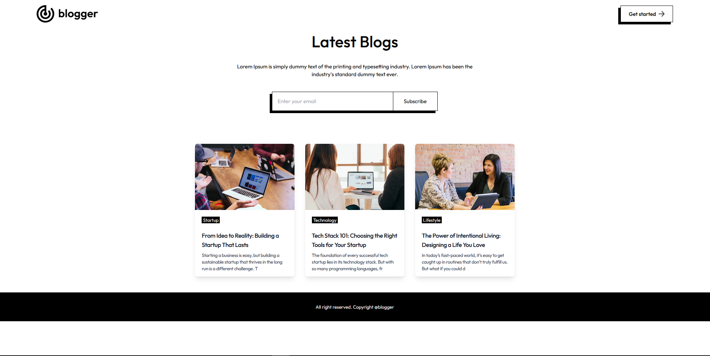
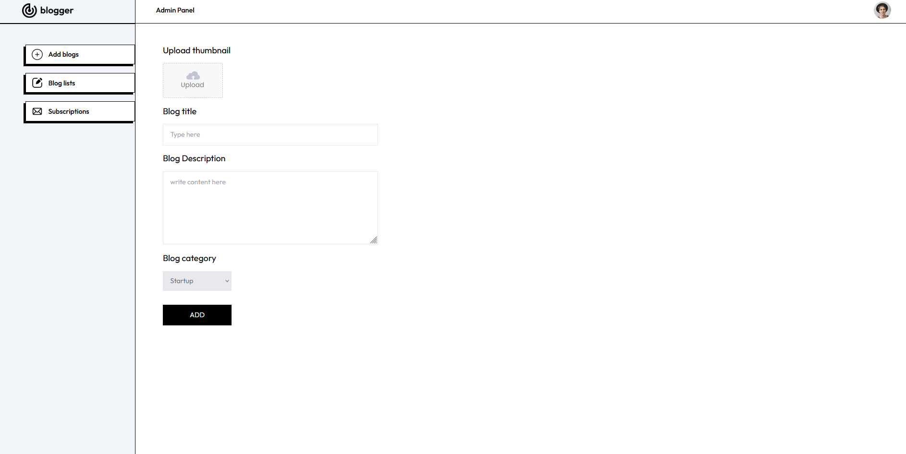

# Modern Blog Platform (WIP - Deployment Stage)

A modern, full-stack blogging platform built with Next.js, featuring a sleek user interface and a powerful admin dashboard. Perfect for content creators and businesses looking for a robust blogging solution.

## Key Highlights

- **Clean & Modern UI**: Minimalist design with focus on readability
- **Responsive Layout**: Seamless experience across all devices
- **Newsletter Integration**: Built-in subscriber management system
- **Admin Dashboard**: Powerful content management tools


*Homepage featuring a modern design with newsletter subscription and categorized blog posts*


*Intuitive admin interface for content management and analytics*

## Tech Stack

**Frontend**
- Next.js 14 - React framework for production
- TailwindCSS - Utility-first CSS framework
- React Toastify - Toast notifications
- Axios - HTTP client

**Backend**
- MongoDB - NoSQL database
- Mongoose - MongoDB object modeling
- Next.js API Routes - Backend API

## Features

**Core Features**
- Responsive design across all devices
- Modern and clean user interface
- Rich text blog editor
- Secure admin dashboard
- Blog analytics

**Content Management**
- Category-based organization
- Newsletter subscription system
- Image optimization
- SEO friendly structure

## Quick Start

1. Clone the repository
```bash
git clone https://github.com/ayubhali/next-blog-app
```

2. Install dependencies
```bash
npm install
```

3. Set up environment variables
```env
MONGODB_URI=your_mongodb_uri
```

4. Run the development server
```bash
npm run dev
```

5. Open [http://localhost:3000](http://localhost:3000) in your browser

## Project Structure

```
├── app/
│   ├── admin/         # Admin dashboard & management
│   ├── api/          # RESTful API endpoints
│   ├── components/   # Reusable UI components
│   └── public/       # Static assets & images
```

## Admin Features

The admin dashboard (`/admin`) provides:
- Blog post creation and management
- Subscriber management
- Analytics dashboard
- Media library
- Site settings

## Deployment Status

**Work in Progress**: This project is currently in the deployment stage. Stay tuned for the live version.

## License

MIT License - feel free to use this project for your own purposes.
